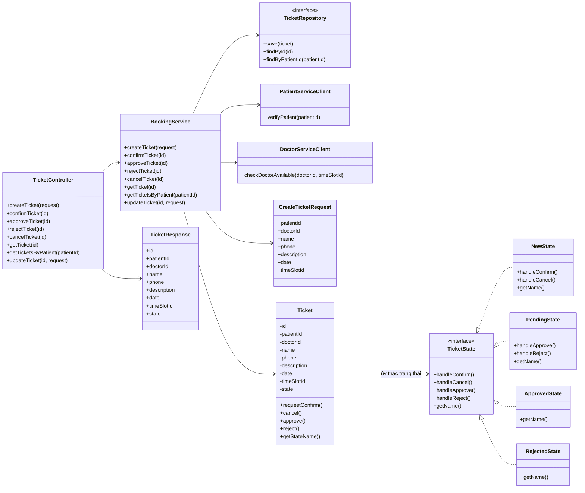
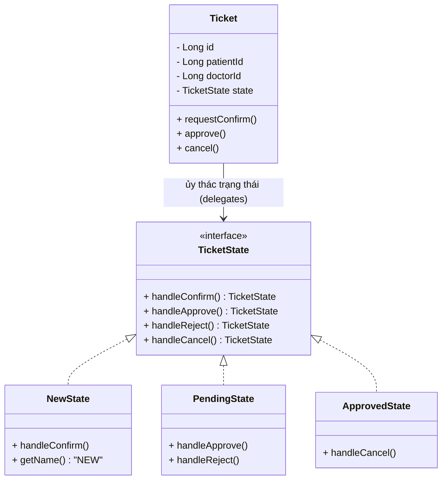
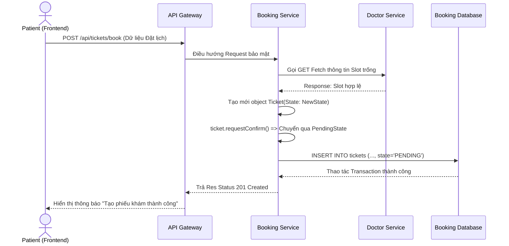
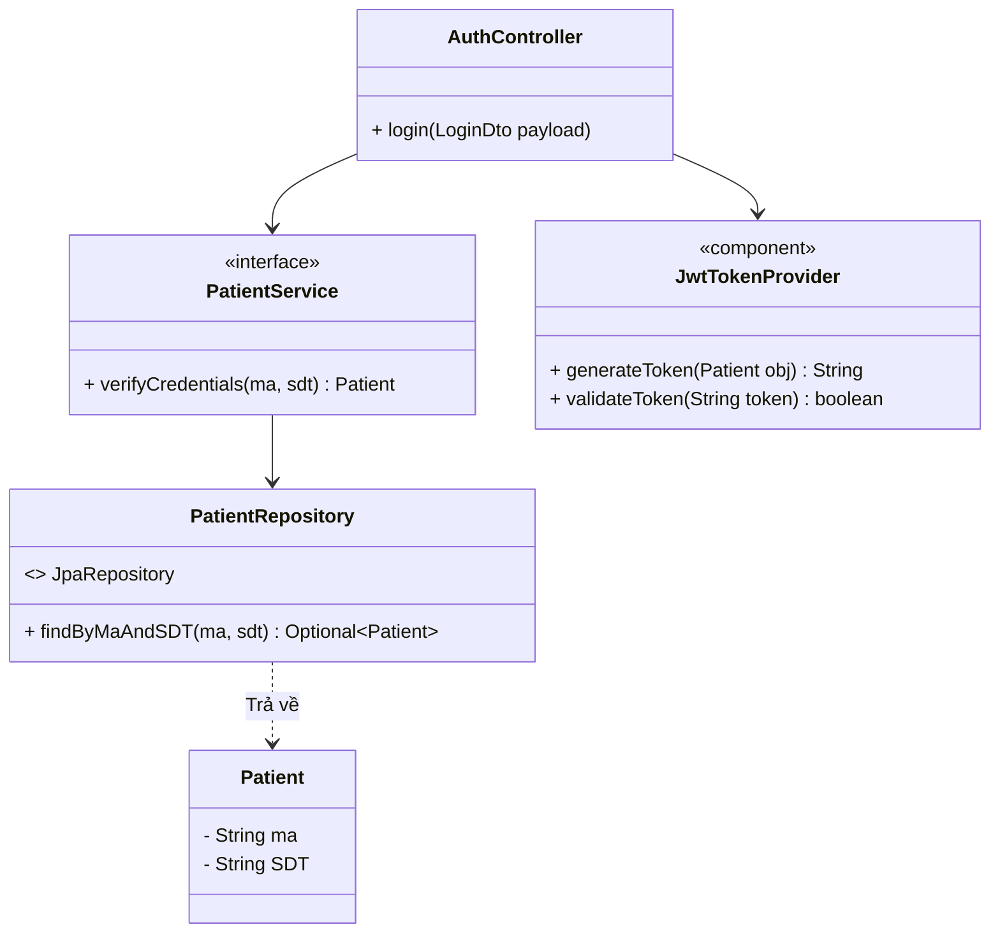
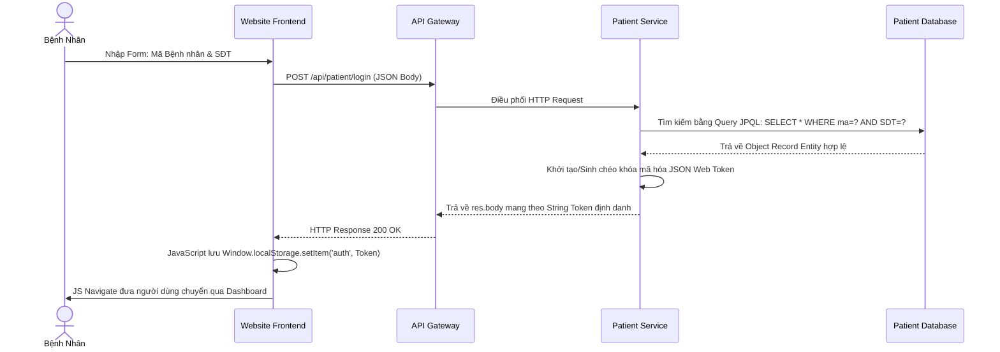

# BÁO CÁO THIẾT KẾ KIẾN TRÚC PHẦN MỀM
**Dự án**: Hệ thống Đặt lịch khám bệnh Healthcare Booking Microservices
**Họ và tên**: (Sinh viên tự điền)
**Mã sinh viên**: (Sinh viên tự điền)

## I. Lựa chọn chức năng và kiến trúc
**1. Các chức năng/module được chọn để trình bày (2 Module chính):**
- **Module Quản lý thông tin Bệnh nhân (Patient Service)**: Chịu trách nhiệm quản lý hồ sơ, xử lý đăng nhập, và xác thực người dùng an toàn.
- **Module Đặt lịch khám bệnh (Booking Service)**: Quản lý luồng tương tác đặt hẹn của bệnh nhân, và đặc biệt là áp dụng **State Design Pattern** để kiểm soát vòng đời trạng thái của Phiếu khám (Ticket). 

*(Ghi chú: Lịch bác sĩ - Doctor Service - phục vụ như một module vệ tinh hỗ trợ cung cấp data phụ trợ, phần báo cáo trọng tâm này xin tập trung vào 2 module nghiệp vụ chính yếu trên).*

**2. Lựa chọn kiến trúc hệ thống:**
- **Kiến trúc theo chiều dọc:** **Microservices**. Hệ thống được chia rẽ thành nhiều dịch vụ độc lập kết nối qua API Gateway (Patient Service, Booking Service,...).
- **Kiến trúc theo chiều ngang:** **Mô hình MVC (Model - View - Controller)** kết hợp với mô hình Client/Server.
  - Backend sử dụng kĩ thuật Spring Boot theo cấu trúc *Controller -> Service -> Repository -> Entity*.
  - Frontend (Client side) được thiết kế giao diện bằng HTML/CSS/JS thuần, sử dụng API RESTful giao tiếp.

---

## II. Hoạt động của các module

### 1. Module Quản lý thông tin Bệnh nhân (Patient Service & Gateway)
- **Nhiệm vụ:** Giải quyết nghiệp vụ đăng nhập và tra cứu hồ sơ người dùng.
- **Hoạt động chính:** Client gửi thông tin chứng thực (Mã bệnh nhân & SĐT), module quét đối chiếu với Database, nếu hợp lệ sẽ trả về chuỗi JSON Web Token (JWT) điều phối bởi API Gateway, dùng làm vé an ninh (security ticket) cho toàn bộ các call API tiếp theo vào trong khu vực Backend.

### 2. Module Đặt lịch khám bệnh (Booking Service)
- **Nhiệm vụ:** Đáp ứng yêu cầu đặt dịch vụ của bệnh nhân trên hệ thống. 
- **Hoạt động chính:** Nhận thông tin đăng ký theo mẫu qua API, kiểm tra chéo (Data fetch) với microservice khác lấy thông tin slot trống, sau đó thiết lập thành object Phiếu khám (`Ticket`). 
- **Điểm nổi bật:** Phiếu khám di chuyển qua nhiều vòng đời trạng thái (`New`, `Pending`, `Approved`, `Rejected`). Module sử dụng Design Pattern (State) nhằm tránh tình trạng code mã rẽ nhánh lồng nhau phức tạp (`if-else` block), tối giản logic và dễ dàng bổ sung trạng thái mới.

---

## III. Thiết kế Thực thể (Entity) & CSDL (Chung)

### 1. Thiết kế Thực thể hệ thống
Các đối tượng thực thể (Domain Models) cốt lõi phục vụ 2 module trình bày bao gồm:
- **Patient**: Đại diện cho thông tin hồ sơ của Bệnh nhân với các thuộc tính như `id`, `ten` (Tên), `ma` (Mã hồ sơ bảo mật), `SDT` (Số điện thoại).
- **Ticket**: Trái tim của Booking Service xử lý thông tin phiếu khám, chứa `id`, `patientId` (khóa ngoại mềm), `doctorId` & `timeSlotId` (lấy từ Doctor Service), `date`, `state` (Trạng thái đặt lịch do lớp TicketState quản lý độc lập).

### 2. Thiết kế Cơ sở dữ liệu (Database Schema)
Microservices áp dụng chiến lược **Database-per-service** (Mỗi dịch vụ chạy cơ sở dữ liệu vật lý/logic độc lập):
- **Cơ sở dữ liệu Patient DB**: Bảng `patients` lưu trữ hồ sơ độc quyền. Các cột `ma` và `SDT` được đánh index để tối ưu tốc độ tra cứu và check Auth.
- **Cơ sở dữ liệu Booking DB**: Bảng `tickets` lưu trữ các phiếu điều hướng lịch hẹn. Thiết kế sử dụng khóa ngoại mềm (`patientId`) trỏ tham chiếu lỏng qua DB của Patient nhằm đảm bảo loose-coupling. Trường `state` được Enum String hỗ trợ convert xuống database lưu dưới dạng VARCHAR.

---

## IV. Thiết kế chi tiết cho từng Module

### 1. Module Đặt lịch khám bệnh (Booking Service)

#### 1.1 Thiết kế giao diện bên client/cho người dùng cuối
- **Màn hình Đặt lịch (Booking Form):** Cung cấp form cho bệnh nhân chọn Chuyên khoa, Bác sĩ, và Khung giờ hẹn. Dữ liệu sẽ dùng JS gọi API (fetch) đổ Select Box. Nút "Xác nhận đặt" sẽ bắn HTTP POST tới Gateway.
- **Màn hình Lịch sử Phiếu khám:** Báo cáo danh sách lịch sử lịch đã xuất cho bệnh nhân. Các Ticket sẽ đánh nhãn (Badge) màu sắc theo trạng thái `New` (Xanh nhạt), `Pending` (Vàng), `Approved` (Xanh lá), `Rejected` (Đỏ) để tạo UX trực quan.

#### 1.2 Sơ đồ tổng quát Booking Service
Sơ đồ dưới đây chỉ thể hiện các thành phần và hàm liên quan trực tiếp đến chức năng đặt lịch khám: tạo phiếu khám, xác nhận, duyệt, từ chối, hủy, xem chi tiết và xem danh sách theo bệnh nhân.

#### 1.3 Thiết kế biểu đồ lớp chi tiết
**Phân tích ưu điểm Pattern:** Thiết kế áp dụng mô hình `State Pattern` trong OOP đối với Entity `Ticket`. Thay vì viết logic thay đổi trạng thái như `if (state == NEW) transferTo(PENDING)`, chúng ta sử dụng đa hình (Polymorphism) bằng interface `TicketState`.
- **Ưu điểm**: Thỏa mãn sát sườn nguyên lý Single Responsibility (Đơn trách nhiệm) và Open/Closed. Mỗi state xử lý logic transition của chính nó, giúp Service/Controller sạch sẽ, gọn gàng và rất an toàn khi muốn cấu hình thêm tính năng State mới vào cấu trúc.

#### 1.4 Thiết kế biểu đồ tuần tự hoạt động chi tiết
**Luồng Khởi tạo và Lưu trữ Vé Đặt lịch**

---

### 2. Module Quản lý thông tin Bệnh nhân (Patient Service)

#### 2.1 Thiết kế giao diện bên client/cho người dùng cuối
- **Màn hình Đăng nhập (Login/Auth Site):** Giao diện chia 2 trường input là `Mã bệnh nhân` & `Số điện thoại`. Hỗ trợ logic Client Side Validation như không được bỏ trống thông tin hộp điền. Các sự kiện "onsubmit" của form trong JS sẽ đánh chặn làm mới thẻ và gửi Payload ngầm.

#### 2.2 Thiết kế biểu đồ lớp chi tiết
- Áp dụng cấu trúc Controller-Service truyền thống của Spring kết hợp Component mở rộng (như `JwtTokenProvider`) để xử lý nghiệp vụ mã hóa độc lập không ảnh hưởng Domain.

#### 2.3 Thiết kế biểu đồ tuần tự hoạt động chi tiết
**Luồng Xác thực Định danh và Cấp Token (Login Flow)**

